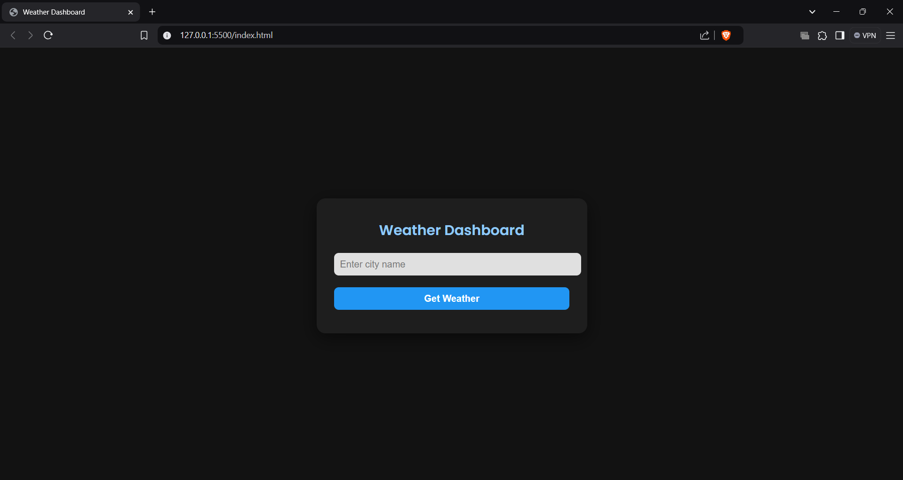
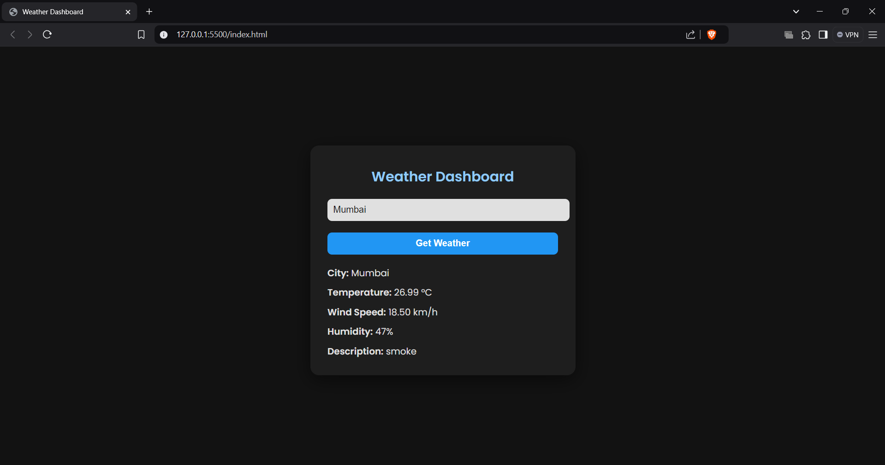

# Weather Dashboard Project

Name: Anurag Tiwari

Company: CODTECH IT SOLUTIONS PVT.LTD

ID: CT08DQL

Domain: Frontend Web Development

Duration: Dec 12th 2024 to Jan 12th 2025

Mentor: [Mentor Name]

## Overview of the Project

Project: Real-time Weather Dashboard Application

## Objective

The objective of this project is to develop a modern, user-friendly weather dashboard that fetches and displays real-time weather information using the OpenWeatherMap API. The application provides users with current weather conditions for any city worldwide through an intuitive interface.

## Key Features

- City-based Weather Search: Users can search for weather information by city name
- Real-time Data: Integration with OpenWeatherMap API for current weather data
- Comprehensive Weather Details:
  - Current temperature in Celsius
  - Wind speed in km/h
  - Humidity percentage
  - Weather description
- Error Handling: Robust error management for invalid cities and API issues
- Responsive Design: Mobile-friendly interface with modern styling

## Technologies Used

- HTML5: Semantic structure and layout
- CSS3: Modern styling features
  - Custom color scheme with dark mode
  - Google Fonts integration (Poppins)
  - Flexbox for layout
  - Box shadows and border radius for modern UI
  - Responsive design
- JavaScript: Core functionality
  - Async/Await for API calls
  - Event handling
  - DOM manipulation
  - Error handling
- APIs:
  - OpenWeatherMap API for weather data

## Implementation Details

1. User Interface:
   - Clean, dark-themed design
   - Input field for city name
   - Action button for weather retrieval
   - Organized display of weather information

2. API Integration:
   - Secure API key implementation
   - Metric unit conversion
   - JSON data parsing and display

3. Core Functions:
   - Event listener for weather data retrieval
   - Async function for API calls
   - Data validation and error handling
   - Dynamic DOM updates for weather information

## Future Enhancements

- 5-day weather forecast
- Weather icons and animations
- Geolocation integration
- Temperature unit conversion (Celsius/Fahrenheit)
- Weather alerts and notifications
- Search history functionality
- More detailed weather parameters
- Interactive weather maps

## API Configuration

- Base URL: api.openweathermap.org
- Required Parameters:
  - API Key
  - City name
  - Units (metric)
- Response Format: JSON

## Setup Instructions

1. Clone the repository
2. Replace `YOUR_API_KEY` with your OpenWeatherMap API key
3. Open index.html in a modern web browser
4. Enter a city name and click "Get Weather"

## Notes

- API key should be kept secure in production environment
- Rate limiting may apply based on API plan
- Consider implementing API key security measures
